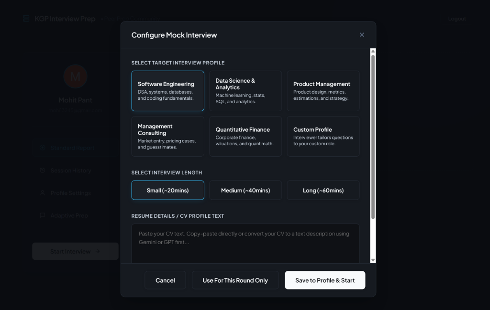
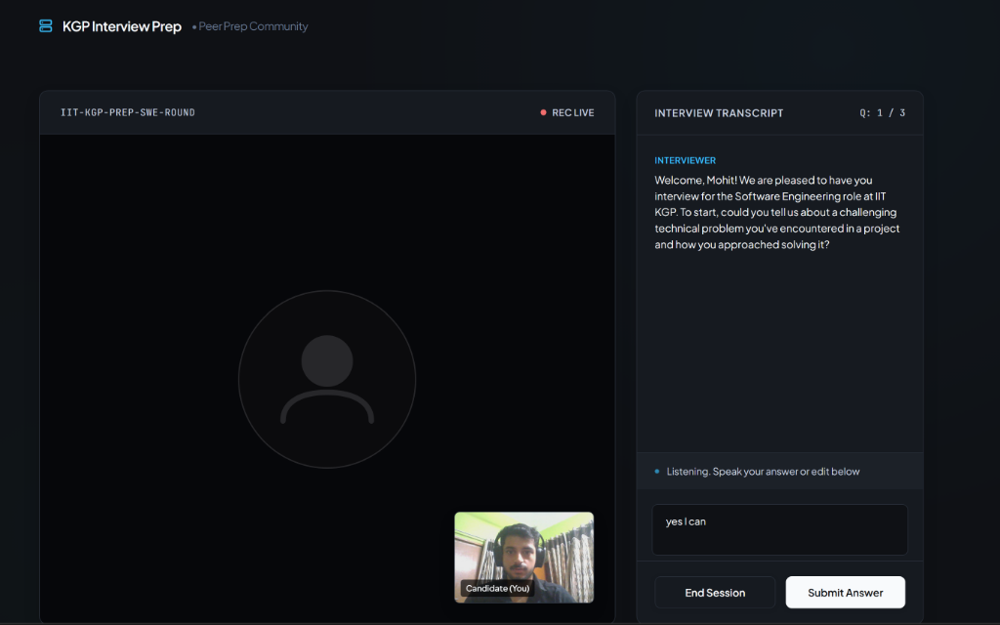
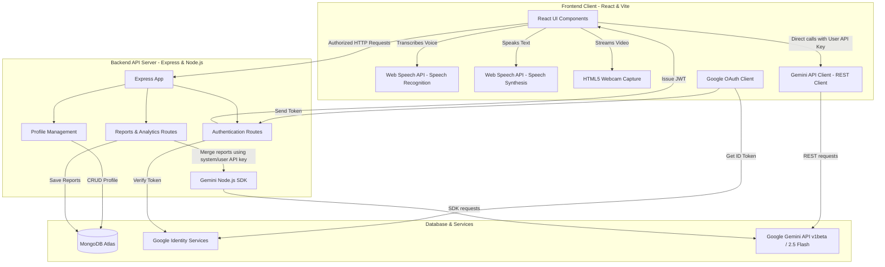

# KGP Interview Prep — AI-Powered Mock Interview Platform

[](https://ai-interview-prep-frontend-smoky.vercel.app/)
[](https://opensource.org/licenses/MIT)

**KGP Interview Prep** is an intelligent, voice-first mock interview preparation platform designed to simulate highly realistic recruitment panels. Candidates can practice with CV-aware technical questions, participate in real-time conversational drills, and receive immediate, multi-dimensional feedback.

Originally built as a placement preparation utility for IIT Kharagpur candidates, the application combines real-time speech-to-text, speech-synthesis, webcam streams, and generative AI evaluations to bridge the gap between candidate practice and real interviews.

---

## 🔗 Live Links
* **Production Frontend**: [https://ai-interview-prep-frontend-smoky.vercel.app/](https://ai-interview-prep-frontend-smoky.vercel.app/)
* **Production Backend API**: [https://ai-interview-prep-backend-beryl.vercel.app/](https://ai-interview-prep-backend-beryl.vercel.app/)

---

## 🚀 Key Features

* **CV-Aware Customization**: Paste resume details, projects, and experiences to receive dynamically personalized questions.
* **Standard Mock Interviews**: A structured simulation evaluating technical depth, communication clarity, problem-solving skills, and poise. It concludes with an exhaustive, multi-dimensional feedback report.
* **Adaptive Practice Modules**: Turn-based conversational drills (up to 4 turns, e.g., Self Introduction, Projects, Strengths & Weaknesses) that evaluate candidate answers dynamically and propose polished alternatives.
* **Dynamic Speech Interruption**: If the candidate speaks mid-question, the text-to-speech synthesis immediately stops to capture the candidate's speech, replicating natural dialogue.
* **Cumulative Performance Report**: Every session is saved, and a master cumulative report tracks long-term performance trends, score progressions, and recurring growth areas.
* **Google OAuth & JWT**: Secure profile creation, API key management, and report history storage.

---

## 🛠️ Tech Stack

### Core Technologies
* **Frontend**: React (v19), Vite, Vanilla CSS (Design system, responsive dark-mode variables)
* **Backend**: Node.js, Express.js (REST API, JWT sessions)
* **Database**: MongoDB Atlas (Mongoose ODM for User & Report schema models)
* **AI Integration**: Google Gemini 2.5 Flash (Question generation, turn-based feedback, cumulative merges)
* **Authentication**: Google Identity Services (`google-auth-library` verification) & stateless JWT sessions
* **Media & Audio**: Web Speech API (SpeechRecognition & SpeechSynthesis), HTML5 Media Devices (webcam preview)

### Tech Stack Breakdown
| Layer | Technology | Usage |
| :--- | :--- | :--- |
| **Frontend Framework** | React (v19) | Application view layer and client state |
| **Build Tooling** | Vite | Fast frontend builds and hot-module replacement |
| **Styling** | Vanilla CSS | Custom, responsive dark-mode variables and layout stylesheets |
| **Backend Runtime** | Node.js (ES Modules) | Server execution environment |
| **Server Framework** | Express.js | API routing and middleware |
| **Database** | MongoDB Atlas | User profile, credentials, and interview report storage |
| **Database ODM** | Mongoose | Schema definitions and validation |
| **AI Integration** | Google Gemini 2.5 Flash | Interview question generation, turn-based feedback, and cumulative merges |
| **Authentication** | Google Identity Services | Single sign-on client authentication |
| **Token Verification** | `google-auth-library` | Google Identity Token signature verification |
| **Session Security** | JWT (`jsonwebtoken`) | Secure stateless user sessions |
| **Local Speech Engine** | Web Speech API | Client-side SpeechRecognition and SpeechSynthesis |
| **Media Streams** | HTML5 Media Devices | Webcam stream render |

---

## 📷 Screenshots

### 1. Mock Interview Configuration


### 2. Active Interview Room


---

## ⚙️ Installation & Local Setup

### Prerequisites
* **Node.js** (v18 or higher recommended)
* **MongoDB** (Local instance or MongoDB Atlas Connection string)
* **Google Cloud Console Credentials** (OAuth 2.0 Web Application Client ID)

### Step 1: Clone and Configure Backend
1. Navigate to the `backend/` directory:
   ```bash
   cd backend
   ```
2. Install dependencies:
   ```bash
   npm install
   ```
3. Copy the environment template:
   ```bash
   cp .env.example .env
   ```
4. Update the variables inside your newly created `.env` file (see Environment Variables section below).
5. Start the backend developer server:
   ```bash
   npm run dev
   ```
   The backend server will run on `http://localhost:5000`.

### Step 2: Configure and Start Frontend
1. Return to the workspace root directory:
   ```bash
   cd ..
   ```
2. Install client dependencies:
   ```bash
   npm install
   ```
3. Configure the environment variables by creating a `.env` file in the root directory:
   ```bash
   VITE_GOOGLE_CLIENT_ID=your_google_client_id_here
   VITE_API_BASE_URL=http://localhost:5000
   ```
4. Start the frontend developer client:
   ```bash
   npm run dev
   ```
   Open your browser and navigate to `http://localhost:5173`.

---

## 🔑 Environment Variables

The project requires several environment variables to function correctly.

### Backend (`backend/.env`)
Create a `.env` file in the `backend/` folder:
```env
PORT=5000
MONGO_URI=mongodb+srv://...           # Your MongoDB connection string
JWT_SECRET=your_jwt_secret_here       # Custom string used to sign session tokens
GOOGLE_CLIENT_ID=your_client_id       # Google OAuth 2.0 Client ID
GOOGLE_CLIENT_SECRET=your_secret      # Google OAuth 2.0 Client Secret
```

### Frontend (`.env`)
Create a `.env` file in the root folder:
```env
VITE_GOOGLE_CLIENT_ID=your_google_client_id_here
VITE_API_BASE_URL=http://localhost:5000
```

---

## 💡 Usage Guide
1. **Google Login**: Authenticate securely using your Google account.
2. **Profile Configuration**: 
   - Enter your personal Google Gemini API Key (stored securely in MongoDB and accessed client-side).
   - Paste your Resume / CV text to customize the generated questions.
3. **Configure Session**: Choose your interview profile, duration, and question count.
4. **Practice Interview**: 
   - Engage with the AI using real-time voice synthesis and recognition.
   - Speak your answers; the AI will listen and can be interrupted dynamically if you start speaking while it's talking.
5. **Review Analytics**: Access comprehensive feedback reports with scoring across multiple metrics (Technical Depth, Problem Solving, Communication Clarity, Poise). Track long-term progress with the Cumulative Performance Report.

---

## 📁 Folder Structure

```text
Online Interviewer/
├── backend/                  # Node.js + Express API Backend
│   ├── middleware/
│   │   └── auth.js           # JWT verification middleware
│   ├── models/
│   │   └── User.js           # Mongoose schemas (User, Report, CumulativeReport)
│   ├── routes/
│   │   ├── auth.js           # Google Identity verification & local JWT issue
│   │   ├── profile.js        # CV profile & Gemini API Key updates
│   │   └── reports.js        # Report saves & Gemini cumulative merges
│   ├── .env.example          # Template for backend server secrets
│   ├── server.js             # Express application entrypoint
│   └── vercel.json           # Vercel Serverless routing config
├── screenshots/              # Application interface visual assets
├── src/                      # React Frontend Source
│   ├── assets/               # Static images and icons
│   ├── utils/
│   │   └── gemini.js         # Gemini API client-side wrappers
│   ├── App.css               # Component specific layout rules
│   ├── App.jsx               # Main React Application UI & Flow router
│   ├── index.css             # Design system base, typography, & global styles
│   └── main.jsx              # React mounting entrypoint
├── index.html                # Vite SPA template entrypoint
├── package.json              # Root dependencies (Frontend)
└── README.md                 # This document
```

### Codebase Reference
For developers analyzing the implementation details:
* **Core React Application**: [App.jsx](file:///c:/Users/Mohit/Desktop/Devlopment/Web%20Dev/Online%20Interviewer/src/App.jsx)
* **Frontend Gemini Client Utils**: [gemini.js](file:///c:/Users/Mohit/Desktop/Devlopment/Web%20Dev/Online%20Interviewer/src/utils/gemini.js)
* **API Server Main Entrypoint**: [server.js](file:///c:/Users/Mohit/Desktop/Devlopment/Web%20Dev/Online%20Interviewer/backend/server.js)
* **User & Report Database Schema**: [User.js](file:///c:/Users/Mohit/Desktop/Devlopment/Web%20Dev/Online%20Interviewer/backend/models/User.js)
* **Session Processing & Report Merging**: [reports.js](file:///c:/Users/Mohit/Desktop/Devlopment/Web%20Dev/Online%20Interviewer/backend/routes/reports.js)
* **JWT Authenticating Middleware**: [auth.js](file:///c:/Users/Mohit/Desktop/Devlopment/Web%20Dev/Online%20Interviewer/backend/middleware/auth.js)

---

## 🔌 API Endpoints

All backend endpoints are prefixed with `/api` and require a JWT token in the `Authorization` header (`Bearer <token>`) except for authentication.

### Authentication
* `POST /api/auth/google`: Authenticates Google ID Token, registers user if new, and returns a local JWT session token and user profile info.

### User Profile
* `GET /api/profile`: Fetches current user profile data (Google details, saved Gemini API Key, resume text, and cumulative report).
* `POST /api/profile`: Updates user's saved Gemini API Key and/or CV resume text.

### Interview Reports
* `GET /api/reports`: Retrieves all interview feedback reports and the latest cumulative report.
* `POST /api/reports`: Saves a new interview report and merges it into the user's Cumulative Performance Report using the Gemini API (or mathematical moving average fallback).

---

## 🏗️ Architecture & Key Challenges

### System Flow
The application follows a modern decoupled client-server architecture with serverless backend processing.



### Key Engineering Challenges Solved

#### 1. Web Speech API Interruption Loops
Simulating natural conversations requires immediate interviewer feedback when interrupted. To prevent audio synthesis overlaps, custom listeners analyze input stream lengths from the transcription pipeline. If intermediate input from the user exceeds a threshold while the AI synthesized voice is active, the application invokes `speechSynthesis.cancel()` immediately to clear the speech queue and focus speech recognition on user responses.

#### 2. Reliable JSON Output Formatting in Serverless Contexts
Because the evaluation report and cumulative updates are generated dynamically by Gemini models, prompts are structured to explicitly request a stringified JSON template. Backups and mathematical fallback systems are integrated on both client and server to preserve baseline performance metrics (e.g. Technical Depth, Problem Solving) in the event of parsing failures.

---

## 🔮 Future Improvements
- **Interactive Coding Workspace**: Integrate a code editor next to the video/voice panel for real-time technical coding assessments.
- **Enhanced Voice Interruption Logic**: Use Web Audio API voice activity detection (VAD) for finer control over user speech interruptions.
- **Analytics Dashboard**: Add charts showing progress trends across technical, communication, and structural metrics.
- **Interview Timer & Difficulty Modes**: Custom question pacing and adjustable AI interviewer personalities (e.g., friendly, aggressive, neutral).

---

## 🤝 Contributing

Contributions are welcome! If you find any bugs or have feature suggestions, please follow these steps:
1. Fork the repository.
2. Create a new branch: `git checkout -b feature-name`.
3. Commit your changes: `git commit -m 'Add feature'`.
4. Push to the branch: `git push origin feature-name`.
5. Open a Pull Request.

---

## 📄 License

This project is licensed under the MIT License. See the [LICENSE](LICENSE) file for details.
