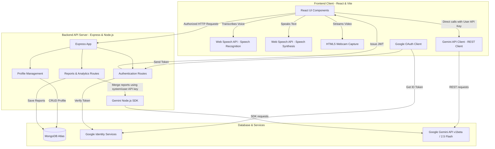

# KGP Interview Prep — AI-Powered Mock Interview Platform

[](https://ai-interview-prep-frontend-smoky.vercel.app/)
[](https://opensource.org/licenses/MIT)

**KGP Interview Prep** is an intelligent, voice-first mock interview preparation platform designed specifically for IIT Kharagpur candidates preparing for placements and internships. Originally built as a personal project for placement preparation, it was later made public to assist the entire student community at IIT Kharagpur and beyond.

The application simulates highly realistic interview environments by combining real-time speech-to-text, speech-synthesis, webcam streams, and generative AI feedback. Candidates can either run standard multi-question mock interviews or practice conversational behavioral drills with immediate, turn-by-turn evaluations.

---

## 🔗 Live Demo
* **Production Frontend**: [https://ai-interview-prep-frontend-smoky.vercel.app/](https://ai-interview-prep-frontend-smoky.vercel.app/)
* **Production Backend API**: [https://ai-interview-prep-backend-beryl.vercel.app/](https://ai-interview-prep-backend-beryl.vercel.app/)
* **Mobile APK**: N/A (Fully responsive web application designed for desktop-first interview simulations)

---

## 📷 Screenshots

### 1. Mock Interview Configuration
Configure interview profiles, select durations, and paste target CV text. The AI parses the CV to generate highly customized technical and situational questions.


### 2. Active Interview Room
Voice-driven workspace featuring real-time speech transcription, text-to-speech audio feedback, and active camera preview to simulate high-pressure recruitment panels.


---

## 🚀 Key Features

* **CV-Aware Customization**: Candidates can paste their resume details, projects, and experiences to receive dynamically personalized questions.
* **Standard Mock Interviews**: A structured simulation evaluating technical depth, communication clarity, problem-solving skills, and poise. It concludes with an exhaustive, multi-dimensional feedback report.
* **Adaptive Practice Modules**: Turn-based conversational drills (up to 4 turns, e.g., Self Introduction, Projects, Strengths & Weaknesses) that evaluate candidate answers dynamically and propose polished alternatives.
* **Dynamic Speech Interruption**: If the candidate speaks mid-question, the text-to-speech synthesis immediately stops to capture the candidate's speech, replicating natural dialogue.
* **Cumulative Performance Report**: Every session is saved, and a master cumulative report tracks long-term performance trends, score progressions, and recurring growth areas.
* **Google OAuth & JWT**: Secure profile creation, API key management, and report history storage.

---

## 🏗️ Architecture & System Flow

The application follows a modern decoupled client-server architecture with serverless backend processing.



---

## 🛠️ Tech Stack

| Layer | Technology | Usage |
| :--- | :--- | :--- |
| **Frontend Framework** | React (v19) | Application view layer and client state |
| **Build Tooling** | Vite | Fast frontend builds and hot-module replacement |
| **Styling** | Vanilla CSS | Custom, responsive dark-mode variables and layout stylesheets |
| **Backend Runtime** | Node.js (ES Modules) | Server execution environment |
| **Server Framework** | Express.js | API routing and middleware |
| **Database** | MongoDB Atlas | User profile, credentials, and interview report storage |
| **Database ODM** | Mongoose | Schema definitions and validation |
| **AI Integration** | Google Gemini 2.5 Flash | Interview question generation, turn-based feedback, and cumulative merges |
| **Authentication** | Google Identity Services | Single sign-on client authentication |
| **Token Verification** | `google-auth-library` | Google Identity Token signature verification |
| **Session Security** | JWT (`jsonwebtoken`) | Secure stateless user sessions |
| **Local Speech Engine** | Web Speech API | Client-side SpeechRecognition and SpeechSynthesis |
| **Media Streams** | HTML5 Media Devices | Webcam stream render |

---

## 📁 Folder Structure

```text
Online Interviewer/
├── backend/                  # Node.js + Express API Backend
│   ├── middleware/
│   │   └── auth.js           # JWT verification middleware
│   ├── models/
│   │   └── User.js           # Mongoose schemas (User, Report, CumulativeReport)
│   ├── routes/
│   │   ├── auth.js           # Google Identity verification & local JWT issue
│   │   ├── profile.js        # CV profile & Gemini API Key updates
│   │   └── reports.js        # Report saves & Gemini cumulative merges
│   ├── .env.example          # Template for backend server secrets
│   ├── server.js             # Express application entrypoint
│   └── vercel.json           # Vercel Serverless routing config
├── screenshots/              # Application interface visual assets
├── src/                      # React Frontend Source
│   ├── assets/               # Static images and icons
│   ├── utils/
│   │   └── gemini.js         # Gemini API client-side wrappers
│   ├── App.css               # Component specific layout rules
│   ├── App.jsx               # Main React Application UI & Flow router
│   ├── index.css             # Design system base, typography, & global styles
│   └── main.jsx              # React mounting entrypoint
├── index.html                # Vite SPA template entrypoint
├── package.json              # Root dependencies (Frontend)
└── README.md                 # This document
```

---

## 💻 Codebase Reference

For developers analyzing the implementation details:
* **Core React Application**: [App.jsx](file:///c:/Users/Mohit/Desktop/Devlopment/Web%20Dev/Online%20Interviewer/src/App.jsx)
* **Frontend Gemini Client Utils**: [gemini.js](file:///c:/Users/Mohit/Desktop/Devlopment/Web%20Dev/Online%20Interviewer/src/utils/gemini.js)
* **API Server Main Entrypoint**: [server.js](file:///c:/Users/Mohit/Desktop/Devlopment/Web%20Dev/Online%20Interviewer/backend/server.js)
* **User & Report Database Schema**: [User.js](file:///c:/Users/Mohit/Desktop/Devlopment/Web%20Dev/Online%20Interviewer/backend/models/User.js)
* **Session Processing & Report Merging**: [reports.js](file:///c:/Users/Mohit/Desktop/Devlopment/Web%20Dev/Online%20Interviewer/backend/routes/reports.js)
* **JWT Authenticating Middleware**: [auth.js](file:///c:/Users/Mohit/Desktop/Devlopment/Web%20Dev/Online%20Interviewer/backend/middleware/auth.js)

---

## ⚙️ Installation & Local Setup

### Prerequisites
* **Node.js** (v18 or higher recommended)
* **MongoDB** (Local instance or MongoDB Atlas Connection string)
* **Google Cloud Console Credentials** (OAuth 2.0 Web Application Client ID)

---

### Step 1: Clone and Configure Backend

1. Navigate to the `backend/` directory:
   ```bash
   cd backend
   ```
2. Install dependencies:
   ```bash
   npm install
   ```
3. Copy the environment template:
   ```bash
   cp .env.example .env
   ```
4. Update variables inside your newly created `.env` file:
   * `MONGO_URI`: Your MongoDB connection connection string.
   * `JWT_SECRET`: A secure string used to sign session cookies.
   * `GOOGLE_CLIENT_ID` & `GOOGLE_CLIENT_SECRET`: Your Google Developer Console credentials.

5. Start the backend developer server:
   ```bash
   npm run dev
   ```
   The backend server will list on `http://localhost:5000`.

---

### Step 2: Configure and Start Frontend

1. Return to the workspace root directory:
   ```bash
   cd ..
   ```
2. Install client dependencies:
   ```bash
   npm install
   ```
3. Configure the environment variables by creating an `.env` file in the root directory:
   ```bash
   # Create a .env file and paste:
   VITE_GOOGLE_CLIENT_ID=your_google_client_id_here
   VITE_API_BASE_URL=http://localhost:5000
   ```
4. Start the frontend developer client:
   ```bash
   npm run dev
   ```
   Open your browser and navigate to `http://localhost:5173`.

---

## 🛠️ Key Engineering Challenges Solved

### 1. Web Speech API Interruption Loops
Simulating natural conversations requires immediate interviewer feedback when interrupted. To prevent audio synthesis overlaps, custom listeners analyze input stream lengths from the transcription pipeline. If intermediate input from the user exceeds a threshold while the AI synthesized voice is active, the application invokes `speechSynthesis.cancel()` immediately to clear the speech queue and focus speech recognition on user responses.

### 2. Reliable JSON Output Formatting in Serverless Contexts
Because the evaluation report and cumulative updates are generated dynamically by Gemini models, prompts are structured to explicitly request a stringified JSON template. Backups and mathematical fallback systems are integrated on both client and server to preserve baseline performance metrics (e.g. Technical Depth, Problem Solving) in the event of parsing failures.
